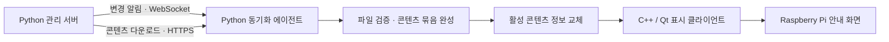

# 원격 관리형 디지털 사이니지

Python 관리 서버와 동기화 에이전트, C++/Qt 표시 클라이언트로 구성한 Raspberry Pi 안내 화면 시스템입니다.
영상·자막·일정을 원격에서 변경하고, 준비된 콘텐츠를 현장 화면에 반영합니다.

> 포트폴리오 README 초안입니다. 현재는 구조와 주요 구현을 소개하며, 선별한 소스와 화면 자료는 후속 정리 예정입니다.

## 프로젝트 배경

여러 안내 화면의 콘텐츠를 기기마다 직접 바꾸는 작업을 줄이고, 원격에서 변경한 내용이 각 화면에 반영되는 과정을 관리하고자 했습니다.
파일 다운로드 도중 화면이 바뀌거나 불완전한 콘텐츠가 표시되지 않도록 서버 배포, 기기 동기화, 화면 표시의 책임을 나눴습니다.

## 구성

Qt는 서버에 직접 연결하지 않고 기기에 준비된 로컬 콘텐츠를 읽습니다. 서버와 동기화 에이전트는 Python으로, 화면은 C++/Qt로 구현했습니다.

## 주요 구현

### 이벤트 기반 콘텐츠 동기화

온라인 기기는 WebSocket 변경 알림으로 새 콘텐츠를 받습니다. 연결이 끊겼던 기기는 재접속 시 서버의 현재 상태를 받아 누락된 변경을 따라갑니다.

### 검증이 끝난 콘텐츠만 적용

동기화 에이전트는 manifest와 파일의 크기·SHA-256을 확인합니다. 콘텐츠 묶음이 준비된 뒤 활성 콘텐츠 정보를 원자적으로 교체합니다.

### 마지막 정상 화면 유지

Qt는 활성 콘텐츠 정보의 변경을 감지해 새 묶음을 읽고 검증합니다. 새 콘텐츠가 유효하지 않으면 마지막 정상 화면을 유지합니다. 대용량 영상 전체의 해시 검증은 GUI 스레드에서 수행하지 않습니다.

### 현장 화면과 미디어 표시

영상 재생, 자막, 시계, 일정 표시와 화면 비율 유지 기능을 구성했습니다. 실제 HDMI 화면 선택과 기존 Linux 그래픽 세션과의 공존도 고려했습니다.

## 사용 기술

| 영역 | 기술 |
| --- | --- |
| 표시 클라이언트 | C++20, Qt 6, QML, Qt Multimedia |
| 서버·동기화 | Python, HTTP/HTTPS, WebSocket |
| 콘텐츠 관리 | JSON manifest, SHA-256, 불변 revision |
| 실행 환경 | Raspberry Pi, Linux, Wayland |

## 검증 관점

원본 프로젝트에는 다음 상황을 확인하는 동기화·표시 테스트가 있습니다. 이 공개 초안에서는 최신 실행 결과나 성능 수치를 제시하지 않습니다.

- 연결 복구 후 최신 콘텐츠 반영
- 파일 손상 검출과 기존 활성 콘텐츠 보존
- 잘못된 콘텐츠 적용 시 마지막 정상 화면 유지
- 콘텐츠 교체와 재생 경계 처리

## 공개 범위

특정 시점의 개발 경험을 소개하는 포트폴리오입니다. 기존 C++/Qt와 Python 구현을 유지하며, 공개할 코드를 별도로 선별합니다.
실제 운영 주소, 기기 인증정보, 현장 콘텐츠와 개인정보는 포함하지 않습니다.

## 추가할 자료

- 비식별 처리한 GUI 및 관리 화면
- 핵심 코드와 설계 설명의 연결
- 콘텐츠 변경·재접속·실패 복구 사례

[개발자 프로필](https://github.com/shear99)
